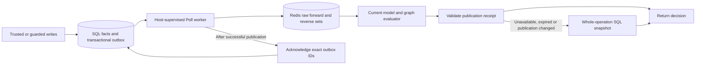

# Authorization model and TupleCache / SQL review

Status: REVIEW COMPLETE — 2026-09-15. Production code unchanged.

## Scope and working rules

- Review the current authorization model, public API, evaluator, durable SQL
  reads/writes and TupleCache protocol. Produce findings and an architectural
  recommendation; do not change production code or migrations.
- Workspace: `main`; preserve existing edits to `plans/cacher-design.md`,
  `plans/gps-360-go-audit-upgrade-handoff.md`, and untracked
  `plans/segovia-v2-audit-upgrade-handoff.md`.
- Use named read-only lead-backend-engineer and data-integration-reviewer roles.
  Their configured opus model is unavailable; retain their instructions with
  the inherited available model.
- Use task-local Go caches and disposable diagnostic files/fixtures only. Do
  not connect to application databases, publish, or deploy.

## Review tasks

- [x] Trace public models, decisions, guarded writes and host integration.
- [x] Audit source snapshots, outbox capture/acknowledgement, raw mirror
  publication, freshness, read consistency and recovery.
- [x] Assess performance, capacity, operational burden and SQL-only tradeoffs.
- [x] Verify concrete findings and run applicable module build/test/vet checks;
  distinguish current evidence from historical verification and skipped suites.
- [x] Record prioritized findings, strengths, recommendation and limitations.

## Verification and findings

Only this review document is intentionally changed. Reviewed HEAD:
`debfddfd1e5d1d4c8812fcb85efc840210359872`.

## Verdict

Keep the model and SQL authority. Keep TupleCache as an opt-in accelerator whose
cost is justified by measurements. The raw mirror is a sounder fit here than a
cache of permission booleans: model changes take effect immediately, and group
changes do not require tracking every derived decision that depended on them.

However, fix ordinary SQL decision consistency first. A reproduced check can
allow access that no committed state granted. Consistent evaluation should be a
property of authorization, independent of enabling a cache.

The cache delivery/recovery protocol is unusually careful. Its main weaknesses
are physical resource costs, global coupling and operational requirements, not
an identified outbox ordering or recovery data-loss bug. This review does not
establish production-scale throughput or all possible failure schedules.

## Mental model

SQL owns facts, atomic writes, roles, enumeration and rebuild state. Redis owns a
reconstructible read projection. Redis persistence is optional recovery help; it
does not change which store is authoritative. Redis does not store decisions or
expanded memberships. Each check still evaluates policy and graph traversal.

| Property | Ordinary SQL decision path today | TupleCache decision path |
| --- | --- | --- |
| Source of truth | SQL | SQL |
| Freshness | Current committed reads, subject to ambient isolation/routing | Delayed writes allowed within host-selected MaxStaleness |
| One operation, one graph state | Not guaranteed for multi-query checks outside a suitable snapshot; finding R1 | One mirror receipt, or whole-operation durable snapshot retry; ambient calls preserve caller view |
| Roles and mixed batches | Durable role reads | Role read rejects cached view and retries whole operation durably |
| Resource enumeration | Durable; bundled SQL lookups have snapshots | Remains durable |
| Decision work | SQL reads plus graph evaluation | Redis reads/decoding plus graph evaluation |
| Mutations | SQL transaction and optional guarded policy | Same SQL transaction, plus captured outbox work |
| Additional operation burden | Database | Optional schema, worker, freshness choice, namespace, Redis capacity/recovery |

## Confirmed findings

### R1 — High: SQL-only checks can combine incompatible committed states

Locations: `logic/relationships/service.go:108`, `:343`, `:359`;
`logic/decisions/composite.go:154`; `stores/turso/read_model.go:17`;
`stores/pgx/read_model.go:18`.

Ordinary Check runs against a reusable reader without opening an operation
snapshot. Through reads navigation first and target permissions later. Outside
an ambient transaction the adapter issues these through the database pool.

Reproduced with real local SQLite and unchanged public APIs; wrappers only
control when a committed writer runs:

1. Document d1 points to folder f1. Alice cannot view f1. Check denies.
2. An in-flight Check reads d1's parent f1.
3. One transaction removes that parent edge and grants Alice viewer on f1.
4. The in-flight Check reads the new viewer grant and allows d1.
5. A new Check denies d1 because the parent edge is absent.

No committed state ever granted that access. The same interleaving under a cold
TupleCache's durable ReadSnapshot denies correctly. The PostgreSQL path has the
same source-level exposure; the specific interleaving was reproduced on SQLite,
not PostgreSQL. A single SQL statement's snapshot does not cover a multi-query
graph operation. PostgreSQL's default read-committed transactions can also use
different snapshots per statement; simply adding a default transaction is not
the complete correction. See the official
[transaction isolation documentation](https://www.postgresql.org/docs/current/transaction-iso.html).

Recommendation: separate operation snapshots from cache configuration; use them
for Check, CheckExplain, CheckBatch and candidate filtering, preserving explicit
ambient transaction ownership/isolation. Reuse the existing snapshot mechanisms
instead of inventing a second evaluator. Update README.md:467's advice to use an
uncached service for stricter reads: freshness and internal consistency are
different guarantees today. Guards already use their transaction-bound view;
this finding is about ordinary decision reads.

Evidence: `/tmp/gopernicus-backend-review/fractured.go`.

### R2 — Medium: Redis client defaults can defeat the configured read deadline

Locations: `logic/tuplecache/runtime.go:219`;
`stores/goredis/tuple_cache.go:32`, `:54`, `:80`.

The runtime sets a context timeout (250 ms by default). The adapter accepts an
arbitrary borrowed redis.Client. In pinned go-redis v9.18.0,
ContextTimeoutEnabled defaults false; the client's I/O context becomes
context.Background unless the option is enabled. The constructor does not
validate this, and the authorization Redis README does not specify it.

A real Redis CLIENT PAUSE diagnostic, with retries disabled to isolate the
cause, measured:

| Client setting | Cache ReadTimeout | Server pause | Time to durable fallback |
| --- | ---: | ---: | ---: |
| ContextTimeoutEnabled=false | 20 ms | 600 ms | 613.5 ms |
| ContextTimeoutEnabled=true | 20 ms | 600 ms | 20.8 ms |

Both paths failed over safely; this is an availability/latency problem, not a
false-grant finding. The probe's durable source intentionally returns a sentinel
error, printed as `unexpected fallback`, to identify arrival at that boundary.

Recommendation: require and validate context-aware client configuration, or
provide a documented construction recipe with that requirement and relevant
socket/retry limits. Do not silently mutate a borrowed client. The repository's
generic Redis integration already enables this option in its Open constructor
and documents it for borrowed clients (`integrations/kvstores/goredis/client.go:135`,
`:171`); bring this adapter's contract into alignment. Add a stalled-server
regression covering the actual network wait.

Evidence: `/tmp/gopernicus-auth-review-20260915/deadline.go` and `deadline.log`.

### R3 — Low: public construction docs still advertise the removed cache API

`README.md:62` names Components.ReadCache and `README.md:94` lists WithCacher,
cacher.Storer and decisions.CachePolicy. Current code exposes Components.TupleCache
and WithTupleCache, and the later upgrade section correctly says to replace the
old API. Public repository comments also retain removed synthetic tuple-ID
language (`logic/relationships/relationship.go:247`).

Recommendation: synchronize the opening API tables and port comments with the
implemented model. This is particularly important when readers are deciding
whether the component is a conventional cache or a maintained projection.

## Material design tradeoffs

### D1 — Whole-set storage puts physical work ahead of semantic budgets

Locations: `logic/tuplecache/reader.go:46`, `:128`, `:175`;
`stores/goredis/tuple_cache.go:91`, `:278`, `:302`;
`stores/goredis/scripts.go:96`, `:117`, `:130`.

Each relation index is one JSON-valued hash field. Reads fetch and decode whole
sets, clone/sort them, then charge the traversal budget. A one-tuple mutation
decodes and rewrites its entire affected forward/reverse sets. Keeping all fields
and metadata in one hash makes whole-key loss safe, but makes the mirror one
shard's responsibility. The adapter does not support Redis Cluster.

Fresh local synthetic measurements: N documents directly granted to one user;
check one document with expansion limit 100. Every check correctly reported the
limit, recorded one cache hit and zero durable fallbacks. One later grant changes
that user's large reverse set.

| Direct grants | Check elapsed | Go allocation bytes | Allocations | One-grant delta elapsed |
| ---: | ---: | ---: | ---: | ---: |
| 100 | 0.61 ms | 93,688 | 1,350 | 0.97 ms |
| 1,000 | 0.80 ms | 641,264 | 12,124 | 2.09 ms |
| 10,000 | 7.70 ms | 6,025,200 | 120,159 | 21.05 ms |
| 100,000 | 56.35 ms | 60,805,472 | 1,200,392 | 188.55 ms |

These are individual Unix-socket measurements, not percentiles, load tests or
SQL comparisons. The allocation metric is cumulative allocation during the
operation, not retained heap or peak RSS. The read check uses the public
TupleCache model-scoped reader; build and delta timings use its real Redis
backend with a synthetic source. A Redis Lua publication blocks other server
work while it executes, so large hot sets affect unrelated requests too;
[Redis documents this behavior](https://redis.io/docs/latest/develop/programmability/eval-intro/).

The subject-first full closure also means a point check depends on the
principal's total reachable grants, even if the requested resource is simple.
Sufficient unrelated grants can turn previously decidable point checks into
budget errors. This preserves the existing SQL contract; it is not a cache
parity bug. I would reconsider this contract before targeting high-cardinality
principals. A target-first strategy would require explicit budget/parity changes.

Recommendation: measure host distributions and set sizes; establish byte/work
limits before decoding large values. Avoid fixing this merely by raising graph
limits. Consider alternate representation/traversal only when the host's
measurements justify the protocol complexity.

Evidence: `/tmp/gopernicus-auth-review-20260915/capacity.go` and `capacity.log`.

### D2 — One receipt avoids partial decisions but couples concurrent traffic

`logic/tuplecache/runtime.go:150`, `:222`, `:229` requires the same receipt from
start to finish. Any publication, including a change to an unrelated resource,
can cause an in-flight decision to discard its work and retry through SQL.
Unchanged raw sets survive the update, which is useful, but evaluations are not
isolated from unrelated publications. The existing publication-during-check test
proves fallback; simultaneous production read/write throughput is unmeasured.

Historical sequential mutate/poll/check benchmarks do not demonstrate hit rates
under overlapping publications. Measure fallback reasons and p95/p99 latency
under the host's sustained write rate before claiming write-heavy scalability.

### D3 — Backlog and rebuild cost can prevent recovery within the freshness policy

Both SQL sources materialize every pending event; a rebuild also materializes
all current tuples (`stores/pgx/tuple_source.go:30`,
`stores/turso/tuple_cache.go:145`). Poll only acknowledges after publication,
and rejects a snapshot/publication that exhausted MaxStaleness
(`logic/tuplecache/runtime.go:157`, `:178`).

If a backlog cannot be processed within that bound, retrying the unchanged
whole batch does not reduce it. Full rebuilds face the same deadline. This is a
source-derived recovery risk, not a reproduced production incident. It remains
safe by using durable fallback, but can indefinitely lose the accelerator and
increase SQL load. A single captured SQL transaction cannot safely be split into
independently visible partial batches merely to reduce costs.

Recommendation: explicitly test largest-tenant rebuilds and outage backlogs;
define an operational recovery path and alerts for backlog age/count/bytes,
snapshot duration, publication duration and time since successful observation.
Current Stats counters alone do not expose these thresholds.

### D4 — Deployment and writer concurrency remain deliberately narrow

- One SQL delivery stream supports one independently maintained Redis mirror.
  Separate namespaces compete over one SQL receipt and trigger rebuilds.
  MaxStaleness is part of the binding, so policy changes require coordinated
  cutover. Multiple workers sharing the same mirror are supported.
- PostgreSQL writers lock both authorization fact tables in SHARE ROW EXCLUSIVE
  mode (`stores/pgx/writes.go:137`). This protects guards, including absent facts,
  but a slow guard/long ambient writer can delay unrelated tenants. Cache reads
  do not improve this write throughput.
- Baseline writers join host transactions. Guarded mutation commands reject
  ambient host transactions (`logic/mutations/repository.go:38`). Hosts combining
  application data and grants must choose the appropriate workflow explicitly.
- Source construction excludes several authority shapes, such as PostgreSQL
  RLS/inheritance, and requires authoritative routing. Remote Turso behavior and
  replica lag must be verified in the adopting environment.

## Opinion on the authorization model

### Keep

- Exact usersets: group:g1, group:g1#member and group:g1#admin have different
  meanings. This avoids implicit membership escalation.
- Immutable compiled models and model filtering on every consumed edge. Old
  facts can remain inspectable without granting authority under a narrowed model.
- Explicit permission ownership between RBAC and ReBAC. It avoids accidental
  union or an implicit administrator override.
- Separate decision services and trusted writers; transaction-bound actor
  guards and guardian invariants; atomic optional audit history.
- Denial versus indeterminate failure, finite semantic budgets, explicit list
  contracts and batching. Failures do not masquerade as complete truncated lists.
- Consumer-owned cache ports and separate adapter modules. A domain-specific
  projection protocol does not belong in the generic SDK cache interface.
- Full old/new mutation capture, receipt compare-and-swap, exact-ID
  acknowledgement, and rebuilding from present facts rather than permanent
  event history. These are necessary safeguards, not ornamental abstraction.

### Reconsider or make much more explicit

The schema is more restrictive than a general arbitrary relationship graph:
`stores/turso/migrations/0006_iam_tuple_identity.sql:47` (and PostgreSQL parity)
enforces one relation per exact resource/subject pair. A user cannot independently
be owner AND billing_contact of the same resource. CreateRelationships silently
preserves an existing different relation (`relationship.go:250`); guarded commands
expose conflicts. This is useful for mutually exclusive membership levels, but
I would prefer exclusivity to be explicit model policy if this pocket is intended
as a general ReBAC system. Changing it requires deliberate API/schema migration,
not a quick unique-index deletion.

The relationship DSL is intentionally an OR of Direct and Through checks, not a
general policy language with intersections, exclusions or contextual conditions.
Role-owned and relationship-owned permissions also cannot share a coordinate.
Keep this small surface if it fits the hosts; document examples requiring host
composition rather than implying general policy expressiveness.

Read consistency and delivery freshness should be separate concepts in the API.
A host should be able to request an authoritative, coherent decision without
enabling Redis or optional capture migrations. Likewise, an authorization guard
must use its transaction-bound DecisionView, never a cached check that can lag.

## Recommended sequence

1. Fix R1 by making coherent operation snapshots independent of caching; add the
   impossible-grant interleaving as an adapter regression.
2. Fix/document R2 and update stale public docs (R3).
3. Keep SQL as the normal baseline. Benchmark real Check/CheckBatch/filter paths
   after the consistency fix; do not infer that SQL is slow from query count alone.
4. Enable TupleCache only where relationship-read measurements justify it and
   the host accepts its revocation delay. Provide a separate coherent durable
   path for immediate post-revocation decisions and other freshness-sensitive work.
5. Before broad adoption, prove capacity/recovery and overlapping-read/write
   behavior, then revisit the representation or traversal where evidence demands.

## Verification record and limits

All root Go commands used `GOCACHE=/tmp/gopernicus-auth-review-20260915/cache`.
No production Go or migration files were edited; no formatter was needed.

Passed:

- `go build ./...`, `go test ./...`, `go vet ./...` in authorization core, Turso
  and PostgreSQL adapter modules. PostgreSQL's initial hermetic run explicitly
  skipped live cases; subsequent live runs below cover them.
- Redis adapter build and vet; `go test -race -json ./...` with actual isolated
  redis-server processes: 18 tests passed, including AOF restart, atomicity,
  interrupted publication and freshness/expiry checks.
- Core `go test -race ./logic/tuplecache ./logic/decisions ./logic/relationships`.
- Turso adapter `go test -race -count=1 ./...`, exercising its actual local
  SQLite fixtures and TupleCache source/conformance tests.
- Disposable PostgreSQL 17.4 `go test -race -count=1 -json ./...`, both default
  schema and `POSTGRES_TEST_SCHEMA=authorization_review_named`: each run passed
  497 tests/subtests, skipped one special non-C locale test. The cluster used
  private Unix sockets with TCP disabled and was stopped cleanly.
- Disposable local SQLite fractured-read reproduction, actual Redis capacity
  and paused-server deadline probes described above.
- `git diff --check`; final git status confirms the original user changes and
  this new review document are the only working-tree changes.

The initial sandboxed Redis suite failed because the OS sandbox prohibited Unix
socket binding. The same suite passed with approved socket access; this was an
environment failure, not a product test failure. The PostgreSQL fixture likewise
needed approved local shared-memory/socket access.

Core's memory TestTransactional deliberately skips its SQL-only ambient contract.
Remote Turso/integration-tag suites, PostgreSQL non-C locale, Firestore emulator
and live services, production host traffic, network latency distributions and
full repository `make check` were not run. No changes were deployed or published.
The newly found regressions remain unfixed because this task is a review.

Logs and diagnostics:

- `/tmp/gopernicus-auth-review-20260915/`: module logs, focused race log,
  capacity/deadline source, binaries and measurements.
- `/tmp/gopernicus-backend-review/fractured.go`: SQLite reproduction.
- `/private/tmp/authorization-sql-review.qfdDH0/pgx-tests-live.json` and
  `pgx-tests-named.json`: PostgreSQL live evidence; fixture stopped.

Additional source-only adapter parity observation: PostgreSQL fully validates
raw tuples while Turso/Redis raw decoding performs weaker structural validation.
Malformed facts from raw SQL can therefore fail at different stages across
adapters. No permission bypass was demonstrated; define common invalid-fact
behavior before promoting this into a correctness finding.
